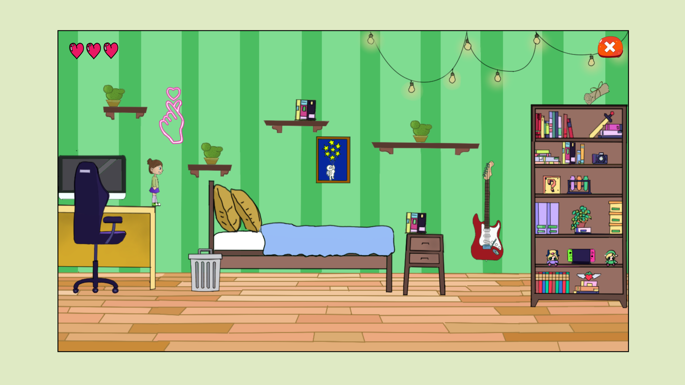
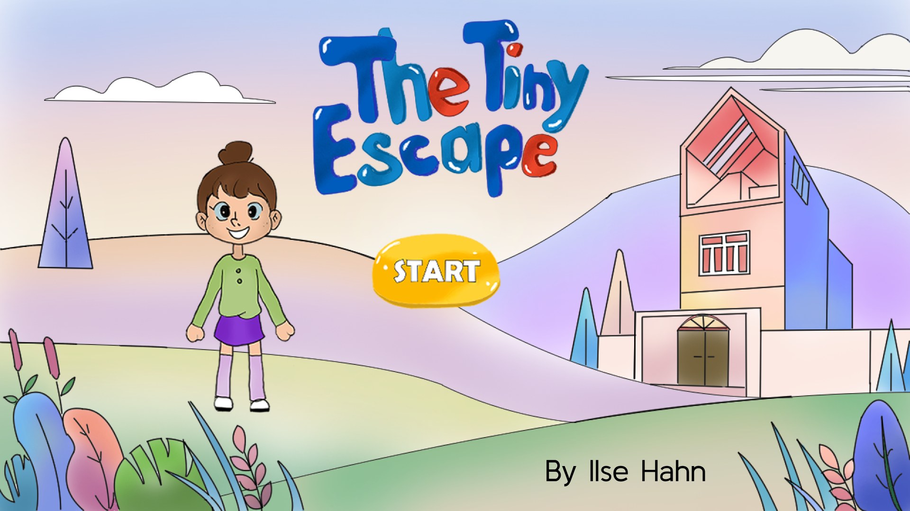
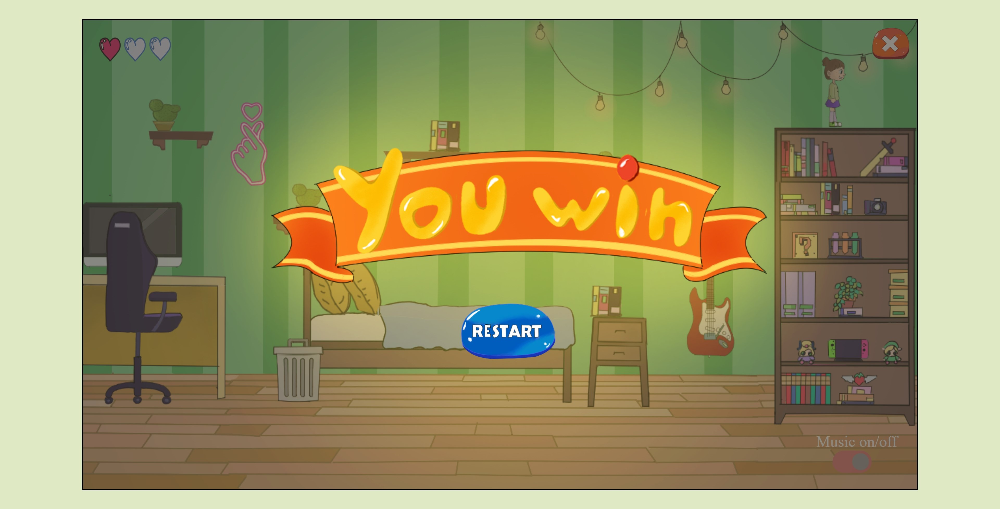
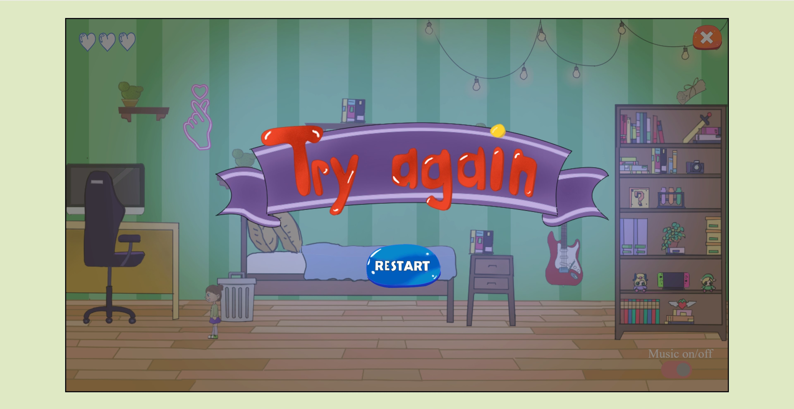
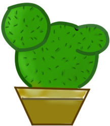
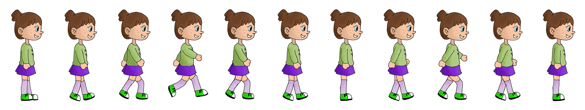
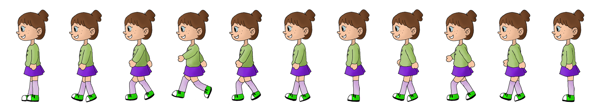
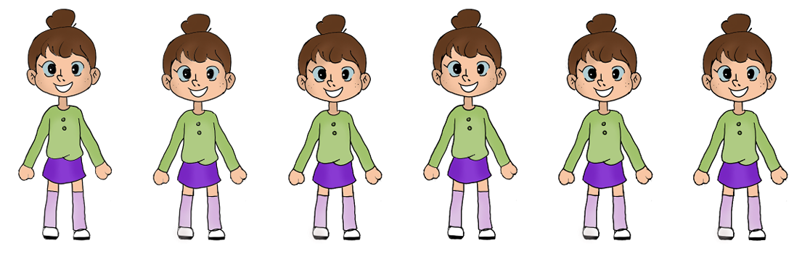
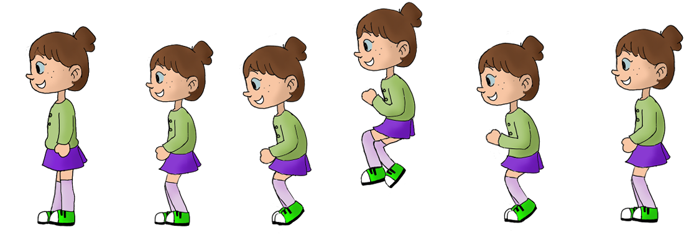
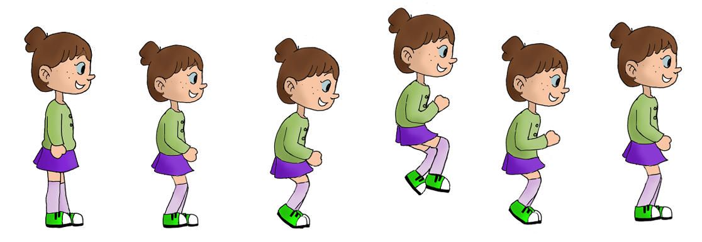

# 🎮 **The Tiny Escape** 

> **Short Pitch**:
> A brief and catchy description of your game. Highlight the concept, genre, and key features.
> "Explore this 2D adventure - platformer where you’ve been mysteriously shrunken and now must explore your house to find pieces of an antidote recipe to return to normal. Each level is a single room full of obstacles. Navigate and avoid the dangerous Kaktus Plant to uncover the truth as you collect each snippet of the recipe. Use WAD to walk and jump, and hold "e" while moving with “a” or “d” to push books and clear your path.

---

## 🌐 **Play the Game**
[Click here to play the game!](https://your-github-username.github.io/repository-name)

---

## 📸 **Screenshots**

### Main Gameplay:

  
  
*Figure 1: Example of gameplay in action.*

---

### Startscreen:

  
  
*Figure 2: Startscreen UI*

---

### Winning UI:

  
  
*Figure 2: Winning Screen UI*

---

### Losing Screen UI:

  
  
*Figure 2: Losing Screen UI*

---

### Challenge Object:

  
  
*Figure 4: A plant that players must avoid. Coming into contact with it you lose one heart!*

---

## 🎨 **Spritesheets**
Below are the sprites used to create characters and objects in the game:

### Player Character:

  
  
  
  
  

  
*Figure 3: Player character animations.*

---

### Challenge Object:

  
  
*Figure 4: A plant that players must avoid. Coming into contact with it you lose one heart!*

---

### Victory Object:

  
  
*Figure 4: A rewarding item symbolizing success in a level, bringing the player one step closer to completing their mission!*

---

## ✍️ **Reflection**

### What went well:
- **Creative Design:** The creative design of the environment and character spritesheets were really fun to create. It was a rewarding experience to see the art bring the game's concept to life.
- **Sound Design:** The background music and sound effects really helped set the mood. It felt like the right vibe for the game, giving it a bit more life and atmosphere as you explored the room

### Challenges:
- **Time Constraints:** I wanted to create more levels but that wasn’t possible due to the limited timeframe.
- **Collision Detection:** Perfecting collision detection for objects and the player was a challenge. I spent a lot of time debugging.

### Lessons Learned:
- **Debugging:** Through trial-and-error and breaking things down step-by-step, I learned the importance of not rushing the debugging process and tackling issues one at a time.
- **Keep it Simple:** Focusing on the main mechanics and the key experience really helped keep the game polished.
